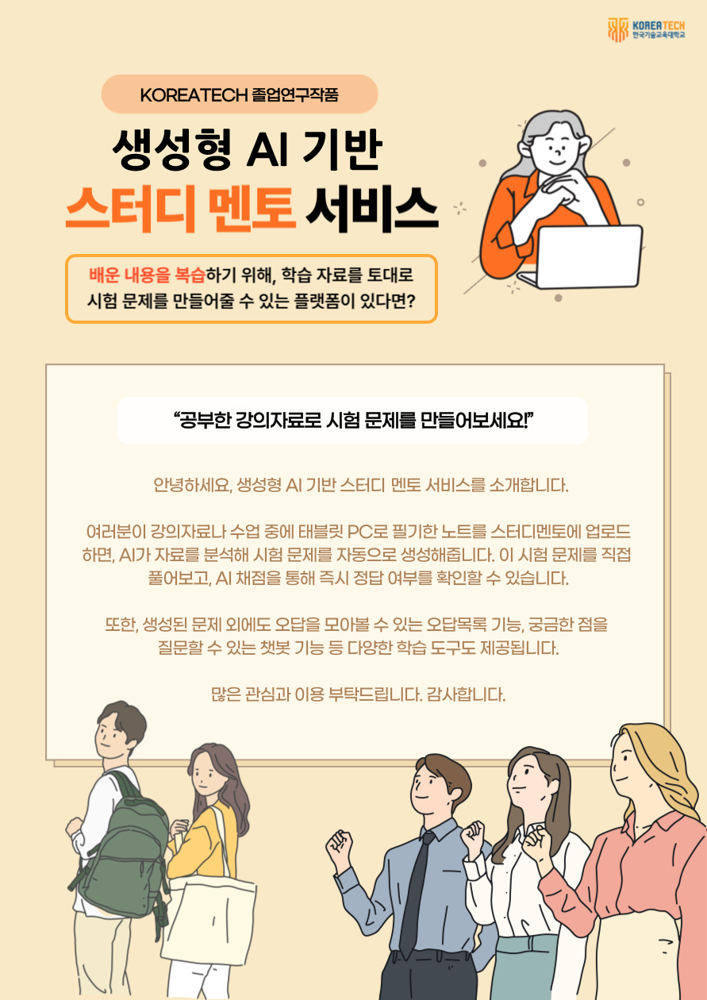

# Study-mentor: 생성형 AI기반 스터디 멘토 서비스

## 🏆 Awards

-   2024년 1학기 컴퓨터공학부 졸업설계 프로젝트 최우수작품
-   2024년 KOREATECH 졸업작품 경진대회 은상

## Tech Stack

## Service Architecture

| Client            | Server        | AI              | Infra             | Database        |
| ----------------- | ------------- | --------------- | ----------------- | --------------- |
| React(Javascript) | Flask(Python) | GPT-4o          | Ubuntu (server)   | Google Firebase |
|                   |               | GPT3.5-turbo    | Netlify (hosting) |                 |
|                   |               | Embedding model |                   |                 |
